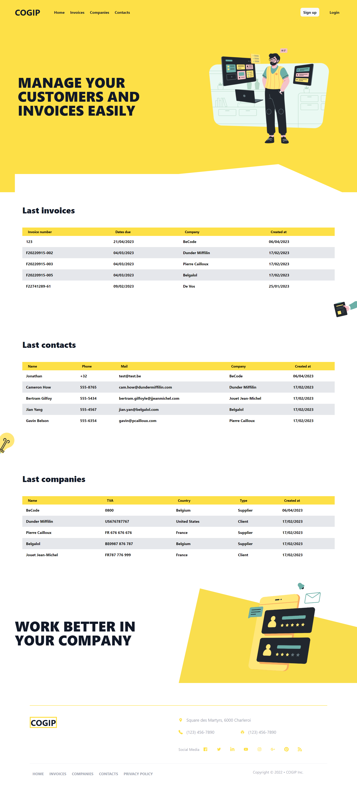

<br/>
<p align="center">
  <h3 align="center">Cogip client</h3>

  <p align="center">
    A finance manager
    <br/>
    <br/>
    <a href="https://github.com/manesjonathan/cogip-client">View Demo</a>
    .
    <a href="https://github.com/manesjonathan/cogip-client/issues">Report Bug</a>
    .
    <a href="https://github.com/manesjonathan/cogip-client/issues">Request Feature</a>
  </p>

     

## About The Project



This a project is an invoice manager with the possibility to create companies (like customer or supplier for example),
contacts and invoices.

This is the front end application that connect to the backend api.

## Built With

React

## Getting Started

This is an example of how you may give instructions on setting up your project locally.
To get a local copy up and running follow these simple example steps.

### Prerequisites

This is an example of how to list things you need to use the software and how to install them.

* npm
* node
* vite

### Installation

1. Clone the repo

```sh
git clone https://github.com/manesjonathan/cogip-client.git
```

2. Install NPM packages

```sh
npm install
```

## Contributing

Contributions are what make the open source community such an amazing place to be learn, inspire, and create. Any
contributions you make are **greatly appreciated**.

* If you have suggestions for adding or removing projects, feel free
  to [open an issue](https://github.com/manesjonathan/cogip-client/issues/new) to discuss it, or directly create a pull
  request after you edit the *README.md* file with necessary changes.
* Please make sure you check your spelling and grammar.
* Create individual PR for each suggestion.
* Please also read through
  the [Code Of Conduct](https://github.com/manesjonathan/cogip-client/blob/main/CODE_OF_CONDUCT.md) before posting your
  first idea as well.

### Creating A Pull Request

1. Fork the Project
2. Create your Feature Branch (`git checkout -b feature/AmazingFeature`)
3. Commit your Changes (`git commit -m 'Add some AmazingFeature'`)
4. Push to the Branch (`git push origin feature/AmazingFeature`)
5. Open a Pull Request

## Authors

[Jonathan Manes](https://github.com/manesjonathan/) - *Full Stack Developer*
